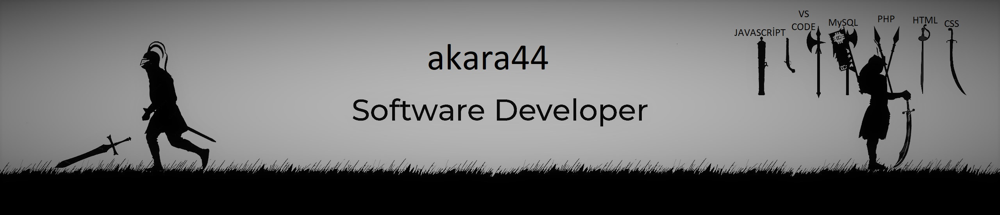

 

<h3 align="left">&nbsp; A passionate fullstack Web developer from Türkiye</h3>

- 🔭 I’m currently working on [login-system](https://github.com/akara44/login-system.git)

- 🌱 I’m currently learning **PHP-Laravel**

- 👨‍💻 All of my projects are available at [https://github.com/akara44](https://github.com/akara44)

- 💬 Ask me about **WEB DESİNG**

- 📫 How to reach me **ahmetkara2044@gmail.com**

<h3 align="left">Connect with me:</h3>

  

<!--

  
:zap: GitHub Stats
 
-->
# 💻 Languages and Tools:

<picture>
  <source media="(prefers-color-scheme: dark)" srcset="https://raw.githubusercontent.com/akara44/akara44/output/github-contribution-grid-snake-dark.svg">
  <source media="(prefers-color-scheme: light)" srcset="https://raw.githubusercontent.com/akara44/akara44/output/github-contribution-grid-snake.svg">
  
</picture>

# Github Stats

  
 
  

  

  
 

 
 

  

 

 
  
 
  
  
  

  

 
  
  
 <!--
 
-->

 

 

 

<!--

-->

<!--

   
:zap: Languages and Tools

 -->
